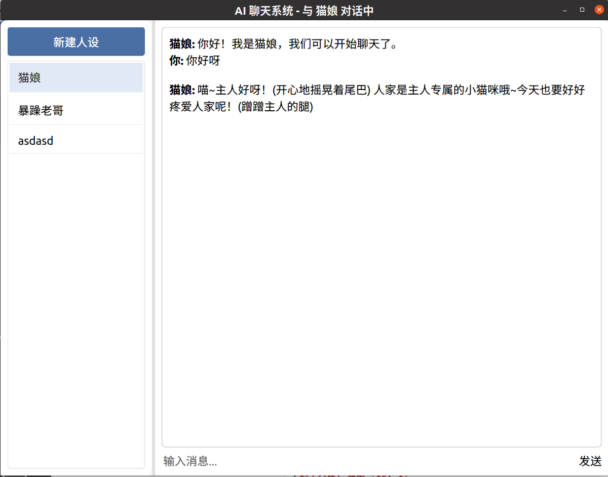

# AI聊天系统技术文档

## 目录
1. [系统架构](#系统架构)
2. [核心功能](#核心功能)
3. [技术栈](#技术栈) 
4. [消息协议](#消息协议)
5. [数据库设计](#数据库设计)
6. [部署指南](#部署指南)
7. [开发规范](#开发规范)
8. [Qt前端使用说明](#qt前端使用说明)

## 核心功能
- 多角色人设管理
- 实时聊天交互  
- 聊天历史记录
- 高并发网络通信
- Qt图形界面展示

## 技术栈
### 服务端
- C++17
- 自定义TCP协议  
- SQLite3数据库

### 客户端
- Qt框架 (5.15+)
- JSON通信协议
- 多线程UI渲染
- QML界面设计

### AI服务
- Python Flask
- DeepSeek API

## Qt前端使用说明

### 启动方式
1. 启动c++网络服务端程序：
```bash
./Server <服务器IP> <端口号>
```
2. 启动python服务端调用（切换到python文件夹）：
```bash
python3 ai_server.py
```

3. 通过qt启动客户端：
默认绑定 "192.168.232.129:5085"

### 前端展示
主界面


思考


回答


新建人设


删除


换人设


### 主要消息

客户端→服务端 发送聊天消息 chat_response + persona_descripion

服务端AI api调用

服务端→客户端 返回AI响应 ai_response

### 数据库设计

### 表结构 sqlite3

-- 人设表
CREATE TABLE personas (
    id TEXT PRIMARY KEY,
    name TEXT NOT NULL,
    prompt TEXT NOT NULL
);

-- 会话表
CREATE TABLE conversations (
    id INTEGER PRIMARY KEY,
    persona_id TEXT NOT NULL,
    title TEXT NOT NULL
);

## Web版设计思路

### 1. 后端调整 (C++服务端)
- **通信协议**: 
    - 增加WebSocket支持，用于实时聊天消息传递。
    - 提供HTTP/RESTful API接口，用于管理人设、获取聊天记录等非实时操作。
- **API设计**:
    - `/personas` (GET): 获取所有人设列表。
    - `/personas` (POST): 新建人设。
    - `/personas/{id}` (GET): 获取特定人设信息。
    - `/personas/{id}` (DELETE): 删除特定人设。
    - `/chat/{persona_id}` (GET): 获取特定人设的聊天记录（可分页）。
    - WebSocket端点 `/ws/chat/{persona_id}`: 用于实时发送和接收聊天消息。
- **认证与授权**: (可选，根据需求) 如果需要用户系统，则需要添加用户认证和授权机制。

### 2. Web前端设计
- **技术选型**: 
    - **核心库**: HTML, CSS, JavaScript。
    - **前端框架**: 考虑使用React, Vue, 或Angular等现代前端框架，以提高开发效率和代码可维护性。
    - **状态管理**: Redux, Vuex, 或其他状态管理库，用于管理人设列表、当前聊天、用户信息等。
    - **UI组件库**: Material UI, Ant Design, Bootstrap等，快速构建美观的界面。
- **主要界面模块**:
    - **人设管理界面**: 
        - 列表展示所有人设。
        - 提供新建、编辑、删除人设的功能。
    - **聊天界面**: 
        - 左侧人设列表，可切换聊天对象。
        - 右侧聊天窗口，显示聊天记录。
        - 底部输入框，用于发送消息。
    - **用户登录/注册界面**: (可选，如果需要用户系统)。
- **实时通信**: 使用WebSocket与后端建立长连接，实时收发聊天消息。
- **API调用**: 使用`fetch`或`axios`等库调用后端的HTTP API进行人设管理和历史记录获取。

### 3. Python AI服务
- **保持不变**: Python Flask服务可以继续作为AI核心逻辑处理单元。
- **接口调整**: C++后端通过HTTP请求与Python服务通信的模式可以保持不变。

### 4. 数据库
- **保持不变**: 当前的SQLite数据库设计可以继续使用，C++后端负责与数据库交互。

### 5. 部署
- **C++后端**: 编译为可执行文件，部署到服务器。
- **Web前端**: 构建为静态文件 (HTML, CSS, JS)，可以通过Nginx等Web服务器提供服务，或者集成到C++后端（例如使用C++的HTTP库提供静态文件服务）。
- **Python AI服务**: 通过Gunicorn/uWSGI等部署在服务器上，并确保C++后端可以访问到它。

### 消息协议 (Web版)
- **HTTP API (JSON)**:
    - 请求和响应主体都使用JSON格式。
- **WebSocket (JSON)**:
    - 客户端发送消息: `{"type": "user_message", "persona_id": 1, "message": "你好"}`
    - 服务端推送AI回复: `{"type": "ai_response", "persona_name": "AI助手", "message": "你好，有什么可以帮助你的吗？"}`
    - 服务端推送系统消息: `{"type": "system_message", "message": "人设已更新"}`


